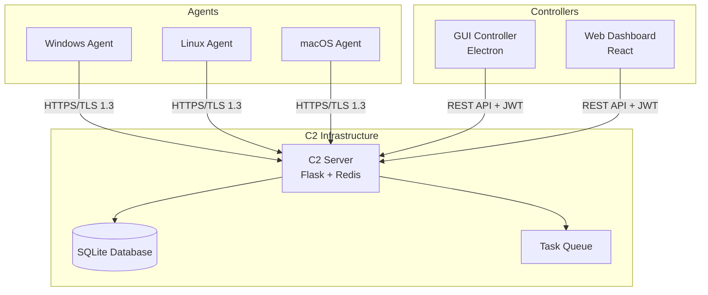

# RAMP Architecture

## System Overview

RAMP (Remote Access Management Protocol) is a modular, scalable remote management framework designed for legitimate system administration and security research.

### Components



## Component Details

### 1. Agent (Go)

**Purpose**: Lightweight client that runs on target systems

**Features**:
- Secure HTTPS communication with certificate pinning
- Cross-platform (Windows, Linux, macOS)
- Command execution
- File transfer with AES-256 encryption
- Persistence mechanisms
- VM/Sandbox detection

**Communication Flow**:
```
1. Agent checks in with C2
2. Heartbeat every 30 seconds
3. Polls for tasks
4. Executes tasks
5. Returns results
```

### 2. C2 Server (Python Flask)

**Purpose**: Centralized command and control server

**Components**:
- **Flask API**: RESTful endpoints for agents and controllers
- **Authentication**: JWT-based with IP whitelisting
- **Database**: SQLite for session management
- **Task Queue**: Redis for scalable task distribution

**API Endpoints**:
- `/api/agent/checkin` - Agent registration
- `/api/agent/tasks` - Task retrieval
- `/api/agent/result` - Result submission
- `/api/agents` - List all agents (protected)
- `/api/agents/<id>/command` - Send command (protected)

### 3. GUI Controller (Electron)

**Purpose**: Desktop application for managing agents

**Features**:
- Connection management
- Real-time agent monitoring
- Interactive terminal emulator (XTerm.js)
- File transfer interface
- Payload generator
- Tools integration (SSL gen, APK signer)

## Security Model

### Encryption
- **Transport**: TLS 1.3 with certificate pinning
- **Files**: AES-256-CFB encryption
- **Authentication**: JWT tokens with expiration

### Evasion
- VM detection (VMware, VirtualBox, QEMU)
- Sandbox detection (resource checks, file indicators)
- Debugger detection

### Persistence
- **Windows**: Registry Run keys + Startup folder
- **Linux**: Systemd services + cron jobs
- **macOS**: LaunchAgents

## Data Flow

### Command Execution
```
Controller → C2 Server → Task Queue → Agent → Execution → Result → C2 → Controller
```

### File Transfer
```
Agent/Controller → AES-256 Encrypt → Base64 → HTTPS → C2 → Decrypt → Storage
```

## Deployment Architecture

### Development
```
Agent (localhost) ← → C2 Server (localhost:8443) ← → GUI Controller
```

### Production
```
Agents (Various networks)
    ↓ HTTPS/443
Cloud C2 Server (AWS/DigitalOcean)
    ↓ HTTPS/443
GUI Controller (Admin workstation)
```

## Scaling Considerations

- Redis for distributed task queues
- Multiple C2 servers behind load balancer
- Database replication for high availability
- Agent connection pooling

## Monitoring & Logging

- Agent heartbeats tracked in database
- All commands logged with timestamps
- C2 server metrics (connections, requests/sec)
- Error tracking with Sentry.io (optional)
